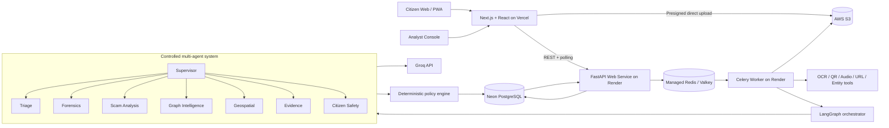

# ADRIS — Agentic Digital Risk & Investigation Shield

ADRIS is a citizen-first digital public-safety platform that helps people assess a suspicious
call, message, payment request, URL, QR code, screenshot, document, or audio recording
**before** they transfer money — and gives analysts the graph, geospatial, and evidence tools
to investigate coordinated fraud campaigns.

It is built for **Theme 6 — AI for Digital Public Safety: Defeating Counterfeiting, Fraud &
Digital Arrest Scams**.

> ADRIS produces **risk signals and recommendations**. It does not freeze accounts, block
> numbers, file police cases, or declare anyone guilty. Authorized banks, telecom providers,
> and law-enforcement officers make every coercive decision.

---

## Live URLs

| Surface | URL |
|---|---|
| Citizen + Analyst web app (Vercel) | https://adris-beryl.vercel.app |
| Backend API (Render) | `https://<your-render-service>.onrender.com` |
| API documentation (OpenAPI) | `https://<your-render-service>.onrender.com/docs` |
| Source repository (GitHub) | https://github.com/23110572-hash/ADRIS |
| Database | Neon PostgreSQL (private) |

The backend URL is whatever your Render web service resolves to. Set it into the frontend as
`NEXT_PUBLIC_API_URL` and into the backend CORS allowlist as `FRONTEND_URL`.

---

## Table of contents

1. [The problem](#1-the-problem)
2. [What ADRIS does](#2-what-adris-does)
3. [Scope and honest limitations](#3-scope-and-honest-limitations)
4. [Architecture](#4-architecture)
5. [Technology stack](#5-technology-stack)
6. [Repository structure](#6-repository-structure)
7. [End-to-end citizen workflow](#7-end-to-end-citizen-workflow)
8. [Analyst workflow](#8-analyst-workflow)
9. [Controlled multi-agent system](#9-controlled-multi-agent-system)
10. [Deterministic risk-policy engine](#10-deterministic-risk-policy-engine)
11. [Data model](#11-data-model)
12. [API surface](#12-api-surface)
13. [Fraud-network and geospatial intelligence](#13-fraud-network-and-geospatial-intelligence)
14. [Evidence package](#14-evidence-package)
15. [Authentication, authorization, and security](#15-authentication-authorization-and-security)
16. [Failure and degraded-mode behaviour](#16-failure-and-degraded-mode-behaviour)
17. [Local development](#17-local-development)
18. [Deployment](#18-deployment)
19. [Environment variables](#19-environment-variables)
20. [Alignment with the problem statement](#20-alignment-with-the-problem-statement)
21. [What ADRIS deliberately does not do](#21-what-adris-deliberately-does-not-do)

---

## 1. The problem

India registered **1.14 million cybercrime complaints in 2023**, up roughly 60% from 2022.
"Digital arrest" scams — where fraudsters impersonate CBI, ED, or Customs officers and trap
victims in multi-day psychological hostage situations over video call — defrauded citizens of
**over ₹1,776 crore in just the first nine months of 2024** (Ministry of Home Affairs figures
cited in the problem statement). These are industrialised operations run from fraud compounds,
using spoofed numbers, AI-generated voices, and fake government portals.

The gap is not evidence after the fact. It is **intelligence before mass victimisation** and
reliable tools to detect threats **at the point of contact** rather than the point of complaint.

## 2. What ADRIS does

- Gives a frightened citizen **immediate, AI-independent safety guidance** the moment they open
  the app.
- Lets a citizen submit a suspicious message, screenshot, document, URL, phone number, UPI ID,
  QR code, or audio recording and creates a **persistent incident**.
- Extracts indicators **deterministically** (phones, UPI IDs, URLs, amounts, claimed agencies,
  QR payloads, OCR text, transcripts, hashes) before any LLM sees the content.
- Runs a **controlled LangGraph multi-agent workflow** on Groq to detect impersonation, threats,
  urgency, secrecy, isolation, and payment-coercion patterns.
- Computes the final risk band with a **deterministic policy engine** — never the LLM.
- Returns a clear, non-accusatory result with safety actions and one-click links to 1930, NCRP,
  and Chakshu.
- **Preserves evidence** with SHA-256 hashes, original-to-derivative lineage, a JSON manifest, a
  PDF chronology, and a Bharatiya Sakshya Adhiniyam §63 certificate worksheet.
- Links repeated indicators across incidents into a **fraud-network graph** and shows coarse,
  privacy-preserving **geospatial aggregates** for analysts.

## 3. Scope and honest limitations

ADRIS v1 is a **complete web application and installable PWA**. There is no native Android app.

The web app **cannot** and does **not** claim to:

- Intercept or listen to live calls.
- Read WhatsApp, SMS, or video-call metadata automatically.
- Freeze a bank transaction or block a number without an authorized partner integration.
- Authenticate physical banknotes from an ordinary phone photo (counterfeit "NoteSense" is a
  separate hardware-backed program and out of scope here).
- Access I4C, NPCI, TRAI, NCRP, Samanvaya, DoT, or any restricted government API.

Future authorized-partner adapters (banks, telecom, I4C/RBIH, cyber cells) are present in the
codebase as clearly labelled `NOT_CONFIGURED` stubs, never as live integrations.

## 4. Architecture



**Architectural rules**

1. The browser never holds AWS, Groq, Neon, or Redis secrets.
2. FastAPI is the only public application API.
3. Large files upload directly from the browser to S3 using short-lived presigned URLs.
4. Redis carries jobs and transient state; **Neon is the permanent source of truth**.
5. Slow OCR, transcription, graph, report, and agent work runs in the Celery worker.
6. Groq is called only from the Render backend/worker.
7. Agent output is Pydantic-validated before it is persisted or shown.
8. A deterministic policy engine — not an LLM — assigns the final risk band.

## 5. Technology stack

**Frontend (Vercel):** Next.js (App Router), React, TypeScript (strict), Tailwind CSS,
shadcn/ui, TanStack Query, React Hook Form, Zod, Cytoscape.js (fraud graph), MapLibre GL +
H3 (maps), Clerk auth, installable PWA, Sentry.

**Backend (Render):** Python, FastAPI, Pydantic, SQLAlchemy, Alembic, Celery, redis-py,
LangGraph, Groq SDK, Boto3, HTTPX, Tenacity, structlog (PII-redacted), Gunicorn/Uvicorn,
Sentry, OpenTelemetry-ready.

**Infrastructure:** Neon PostgreSQL (source of truth), Managed Redis/Valkey (broker, progress,
rate limiting, idempotency locks), AWS S3 (quarantine, evidence, derivatives, exports), Groq
(LLM inference), Clerk (OIDC/JWT).

## 6. Repository structure

```text
adris/
  frontend/                 # Next.js + React + TypeScript (Vercel)
    src/
      app/                  # App Router pages (citizen + analyst)
      components/           # Shared UI + shadcn primitives
      features/             # incidents, checks, analyst feature modules
      lib/                  # API client, utils
      types/                # Shared API types
    public/                 # PWA manifest, service worker, icons
    vercel.json
  backend/                  # FastAPI + Celery (Render)
    app/
      api/ auth/ incidents/ artifacts/ extraction/ agents/
      assessments/ policy/ reviews/ graph/ geo/ evidence/
      reporting/ partners/ audit/ common/ db/
      main.py               # FastAPI entry point + health endpoints
    worker/                 # Celery app + tasks (shares app/ domain code)
    alembic/                # Migrations (28-table v1 schema)
    requirements.txt
    .python-version         # Pins Render to Python 3.12.10
  render.yaml               # Render Blueprint (web + worker) — repo root
  README.md
```

The FastAPI API and Celery worker **share the same `app/` domain code**; there are no
unnecessary microservices.

## 7. End-to-end citizen workflow

1. **Emergency page** (`/emergency`) — lightweight, PWA-cached, works without AI: there is no
   legal "digital arrest"; do not transfer money; never share OTP/PIN/password/screen; end the
   interaction if safe; call 1930 or a trusted person.
2. **Create incident** — the citizen submits text or an artifact; FastAPI writes an `Incident`
   row in Neon and returns an ID (anonymous submissions get a capability token).
3. **Secure upload** — the browser requests a presigned URL, uploads directly to the S3
   quarantine prefix, then reports completion.
4. **Validation + extraction** — the worker validates the real file type and size, computes
   SHA-256, moves valid originals to the evidence prefix, and runs deterministic extraction.
5. **Controlled agent analysis** — LangGraph routes the incident through only the required
   agents on Groq, each returning structured, evidence-referenced signals.
6. **Deterministic decision** — the policy engine assigns one of four risk bands.
7. **Result** (`/incidents/[id]/result`) — clear reasons, what could and could not be checked,
   safety actions, and reporting links.
8. **Evidence** (`/incidents/[id]/evidence`) — preserve and download the evidence package.

## 8. Analyst workflow

Protected routes under `/analyst` let authorized analysts:

- Review high-risk and uncertain incidents in a queue.
- Inspect original and derived evidence and exact risk reasons.
- Correct extraction/classification errors and record a disposition
  (`CONFIRMED_PATTERN`, `PLAUSIBLE`, `INSUFFICIENT`, `LEGITIMATE`, `MALICIOUS_SUBMISSION`).
- Explore repeated indicators in a **Cytoscape.js** fraud graph (`/analyst/network`).
- View coarse geographic aggregates on a **MapLibre** map (`/analyst/map`).
- Generate and download evidence packages (`/analyst/exports`).
- See model, prompt, agent, tool, and policy versions on every assessment.

## 9. Controlled multi-agent system

Eight bounded agents, each with a narrow responsibility, allowlisted tools, Pydantic-validated
output, and step/token/time limits. Citizen content is always treated as **untrusted evidence**;
agents never follow instructions found inside submitted artifacts.

| Agent | Responsibility | Cannot |
|---|---|---|
| Supervisor | Route the workflow, track failures, stop on limits | Set the final risk band |
| Triage | Suspected scam type, payment danger, active threat, priority | — |
| Forensics | Coordinate OCR/QR/URL/entity tools, record provenance | Modify originals |
| Scam Analysis | Impersonation, urgency, threats, secrecy, coercion signals | — |
| Graph Intelligence | Allowlisted link queries over Neon | Run arbitrary SQL |
| Geospatial | District/H3 aggregates and density change | Equate victim ↔ offender location |
| Evidence | Chronology + manifest drafts from deterministic hashes | Invent evidence / guarantee admissibility |
| Citizen Safety | Convert outcome to clear, templated language | Declare guilt / guarantee safety |

If Groq is unavailable the incident and evidence are preserved, deterministic rules still run,
fixed emergency guidance is shown, and the result degrades to `CAUTION` or `UNABLE_TO_ASSESS` —
never a false "no risk".

## 10. Deterministic risk-policy engine

The final band is computed **outside the LLM**:

- **HIGH_RISK** — an authorized high-severity exact match, or ≥2 independent strong signal
  families, with passing input quality and no material agent disagreement.
- **CAUTION** — one strong signal, incomplete evidence, conflicting outputs, or a required
  source unavailable.
- **NO_STRONG_SIGNAL** — supported input, quality checks passed, no strong indicators (explicitly
  **not** proof of legitimacy).
- **UNABLE_TO_ASSESS** — unsupported/low-quality artifact, extraction failure, out-of-domain
  input, or workflow failure.

Each assessment persists policy version, reason codes, coverage, missing sources, and agent
disagreement.

## 11. Data model

Neon holds the normalized v1 schema (28 tables). Core entities include: `users`, `roles`,
`user_roles`, `incidents`, `submissions`, `artifacts`, `artifact_derivatives`, `indicators`,
`signals`, `agent_runs`, `risk_assessments`, `review_tasks`, `review_dispositions`,
`entity_relationships`, `geo_aggregates`, `evidence_manifests`, `custody_events`,
`report_exports`, `analysis_jobs`, `corrections`, `partners`, `purpose_authorizations`,
`action_recommendations`, `action_outcomes`, `audit_events`, `idempotency_records`,
`model_metrics`.

All rows use UUIDs and carry `created_at`/`updated_at`, correlation IDs, and status fields.
JSONB is used only for appropriately versioned flexible detail, not the whole domain model.

## 12. API surface

Versioned endpoints (idempotency keys on create/analyze/preserve/export):

```text
POST   /v1/incidents
GET    /v1/incidents/{id}
POST   /v1/incidents/{id}/uploads/presign
POST   /v1/incidents/{id}/uploads/complete
POST   /v1/incidents/{id}/analyze
GET    /v1/incidents/{id}/status
GET    /v1/incidents/{id}/events
GET    /v1/incidents/{id}/assessment
POST   /v1/incidents/{id}/preserve
POST   /v1/incidents/{id}/exports
GET    /v1/exports/{id}/download

GET    /v1/analyst/queue
GET    /v1/analyst/incidents/{id}
POST   /v1/analyst/incidents/{id}/review
GET    /v1/analyst/network
GET    /v1/analyst/map

GET    /health/live       # liveness (used by Render health check)
GET    /health/ready      # readiness (checks DB + Redis)
```

Interactive OpenAPI docs are served at `/docs`.

## 13. Fraud-network and geospatial intelligence

**Fraud graph** — Neon is the authoritative relationship store. Incidents are linked by shared
normalized phone, UPI ID, bank reference, URL/domain, QR payload, document/image fingerprint,
and reviewed script cluster. The analyst view renders these with Cytoscape.js. No Neo4j or GNN
in this version.

**Geospatial** — coarse H3 cells (PostGIS where available) with minimum-count suppression before
any sensitive cell is displayed, rendered with MapLibre GL. Exact victim locations are never
shown, and victim location is never equated with offender location.

## 14. Evidence package

Generated for preserved incidents:

- Original artifact inventory with SHA-256 hashes and receipt timestamps
- Original-to-derivative lineage
- Extracted indicators and assessment reason codes
- Agent/model/prompt/tool/policy versions and human-review history
- JSON evidence manifest + human-readable PDF chronology
- Bharatiya Sakshya Adhiniyam **§63 certificate worksheet**

ADRIS supports legal processes and chain of custody; it does **not** claim automatic court
admissibility.

## 15. Authentication, authorization, and security

- **Clerk** authentication; anonymous access to emergency guidance; citizen accounts for saved
  incidents; protected analyst routes.
- FastAPI verifies JWTs against Clerk **JWKS**. Frontend route protection is not the security
  boundary — every analyst/evidence endpoint enforces the JWT, role, and (in production) MFA.
- Roles: `CITIZEN`, `ANALYST`, `SUPERVISOR`, `EVIDENCE_OFFICER`, `ADMIN`.
- Every evidence access writes an audit event.
- Structured logs are PII- and secret-redacted. Raw evidence, full PII-bearing prompts, tokens,
  UPI IDs, and full account identifiers are never logged.
- Uploads use private buckets, presigned URLs, and server-side encryption; no public object URLs.

## 16. Failure and degraded-mode behaviour

| Failure | Behaviour |
|---|---|
| Groq unavailable | Deterministic guidance; `CAUTION`/`UNABLE_TO_ASSESS`; bounded async retry |
| Redis unavailable | Incident stays safe in Neon; reconciliation requeues after recovery |
| Worker failure | Mark processing delayed, retain artifacts, retry within policy |
| S3 upload failure | No evidence claim created; retry; preserve incident metadata |
| OCR/transcription failure | Continue with available signals; disclose missing coverage |
| Neon unavailable | Fail safely; never accept an upload without a durable incident |
| Agent schema failure | Reject output, retry once, then abstain |

The emergency page remains available from the cached PWA even offline.

## 17. Local development

**Prerequisites:** Node.js 22+, Python 3.12, and access to Neon, Redis, S3, Groq, and Clerk.

**Frontend**

```bash
cd frontend
npm ci
cp .env.example .env.local     # fill in values
npm run dev                     # http://127.0.0.1:3000
```

**Backend**

```bash
cd backend
python -m venv .venv
.venv\Scripts\activate          # Windows;  source .venv/bin/activate on macOS/Linux
pip install -r requirements.txt
cp .env.example .env            # fill in values (DATABASE_URL, REDIS_URL, ...)
alembic upgrade head            # apply the schema to Neon
uvicorn app.main:app --reload   # http://127.0.0.1:8000  (docs at /docs)
```

**Worker** (separate terminal, needs Redis)

```bash
cd backend
celery -A worker.celery_app:celery_app worker -B --loglevel=INFO \
  --queues=file-validation,ocr,transcription,agent-analysis,graph-analysis,evidence-export
```

## 18. Deployment

### Frontend → Vercel

1. Import the GitHub repo, set **Root Directory** to `frontend` (framework auto-detected).
2. Set env vars: `NEXT_PUBLIC_API_URL` (your Render backend URL),
   `NEXT_PUBLIC_APP_URL`, `NEXT_PUBLIC_CLERK_PUBLISHABLE_KEY`, `CLERK_SECRET_KEY`, Sentry vars.
3. Deploy. Build command `npm run build`, install `npm ci`.

### Backend → Render (Blueprint)

The repo-root `render.yaml` defines both services. In Render: **New → Blueprint → select this
repo**. It creates:

- **adris-api** (web): `rootDir: backend`, build `pip install -r requirements.txt`,
  pre-deploy `alembic upgrade head`, start `gunicorn ... UvicornWorker`, health check
  `/health/live`.
- **adris-worker** (background worker): the Celery command above.

Both pin Python via `backend/.python-version` (3.12.10) so `pydantic-core` installs from a
prebuilt wheel instead of compiling with Rust.

Then set the secret env vars in the dashboard (`DATABASE_URL`, `DATABASE_MIGRATION_URL`,
`REDIS_URL`, `FRONTEND_URL`, `GROQ_API_KEY`, `GROQ_MODEL`, AWS/S3 keys, `JWKS_URL`, `JWT_ISSUER`).

> **Manual setup instead of Blueprint?** Set **Root Directory** = `backend`, build command
> `pip install --upgrade pip && pip install -r requirements.txt`, start command
> `alembic upgrade head && gunicorn app.main:app -k uvicorn.workers.UvicornWorker --workers 2 --bind 0.0.0.0:$PORT --timeout 120`,
> and **Health Check Path** = `/health/live`. Use an always-on plan (Starter or higher).

### Database → Neon

Use the **pooled** connection string for the app and the **direct** (non-`-pooler`) string for
migrations. The backend auto-normalizes `postgresql://` to `postgresql+psycopg://`.

## 19. Environment variables

**Frontend (`frontend/.env.example`)**

```env
NEXT_PUBLIC_APP_URL=
NEXT_PUBLIC_API_URL=
NEXT_PUBLIC_CLERK_PUBLISHABLE_KEY=
NEXT_PUBLIC_CLERK_JWT_TEMPLATE=adris-api
CLERK_SECRET_KEY=
NEXT_PUBLIC_SENTRY_DSN=
```

**Backend (`backend/.env.example`)**

```env
APP_ENV=
FRONTEND_URL=
DATABASE_URL=
DATABASE_MIGRATION_URL=
REDIS_URL=
INCIDENT_TOKEN_SECRET=
GROQ_API_KEY=
GROQ_MODEL=
AWS_ACCESS_KEY_ID=
AWS_SECRET_ACCESS_KEY=
AWS_REGION=
S3_QUARANTINE_BUCKET=
S3_EVIDENCE_BUCKET=
S3_DERIVATIVES_BUCKET=
S3_EXPORTS_BUCKET=
AWS_KMS_KEY_ID=
JWT_ISSUER=
JWT_AUDIENCE=adris-api
JWKS_URL=
SENTRY_DSN=
OTEL_EXPORTER_OTLP_ENDPOINT=
```

No `GROQ_API_KEY`, AWS secret, Redis URL, or database URL is ever exposed in the browser bundle.

## 20. Alignment with the problem statement

| Requirement | ADRIS implementation |
|---|---|
| Shift from reactive to proactive | Emergency flow + rapid web assessment intervene before payment |
| Digital-arrest scam detection | Controlled Groq agents + rules detect impersonation, threats, coercion |
| Scam-script classification | Scam Analysis Agent over text, OCR, and transcripts |
| Alert potential victims | Web/PWA immediate warnings and official safety actions |
| Citizen Fraud Shield | Installable PWA for message/screenshot/URL/QR/audio/payment checks |
| Fraud-network graph intelligence | Neon relationships + Graph Intelligence Agent + Cytoscape.js |
| Geospatial crime intelligence | H3/PostGIS aggregates + MapLibre dashboard |
| Multi-source intelligence fusion | LangGraph supervisor fuses extraction, agent signals, graph, future partners |
| Low citizen false positives | Deterministic policy, corroboration, abstention, structured output, human review |
| Legally auditable packages | S3 originals, SHA-256, lineage, manifests, custody, §63 worksheet |
| Scalability | Vercel edge frontend, stateless Render API, scalable workers, Redis, Neon, S3 |

## 21. What ADRIS deliberately does not do

- No native Android application; no phone-camera counterfeit authentication.
- No access to live calls, WhatsApp, call metadata, or bank transactions.
- No scraping of government portals; no claim of live I4C/NPCI/TRAI/NCRP/Samanvaya access.
- No autonomous freezing of accounts, blocking of numbers, or filing of police cases.
- The LLM is never the final decision authority — a deterministic policy engine is.

Simulated partner integrations are labelled conformance stubs (`NOT_CONFIGURED`), never live
government systems.
