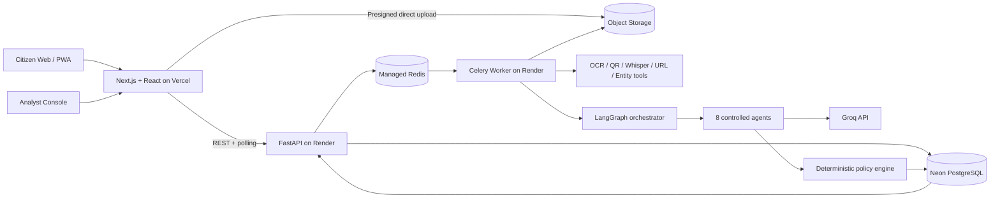

# ADRIS — Agentic Digital Risk & Investigation Shield

**A citizen-first digital public-safety platform that stops digital-arrest and payment-fraud scams at the point of contact — before the money leaves the victim's account.**

Built for **The Economic Times hackathon — Theme 6: AI for Digital Public Safety (Defeating Counterfeiting, Fraud & Digital Arrest Scams).**

| | |
|---|---|
| Live app (Vercel) | https://adris-beryl.vercel.app |
| Backend API (Render) | https://adris.onrender.com · docs at `/docs` |
| Source | https://github.com/23110572-hash/ADRIS |

---

## 1. The problem we set out to solve

India recorded **1.14 million cybercrime complaints in 2023 — a 60% jump over 2022 — and the curve is still climbing.** The fastest-growing and most brutal category is the **"digital arrest" scam**: fraudsters posing as CBI, ED, or Customs officers hold victims hostage over multi-day video calls, manufacture fake warrants, and coerce them into transferring their life savings to a "safe account." In just the first nine months of 2024, these operations drained **over ₹1,776 crore** from Indian citizens.

These are not lone opportunists. They are **industrialised operations** run from fraud compounds, frequently across borders, armed with spoofed numbers, AI-generated voices, and pixel-perfect fake government portals. The victim is isolated, terrified, and rushed — by design.

We looked hard at where the system breaks, and the answer was clear: **the country does not lack evidence after the fact — it lacks intelligence before mass victimisation, and it lacks a reliable tool that works at the exact moment of contact rather than at the moment of complaint.** By the time a complaint reaches 1930 or NCRP, the money is already gone and the network has already moved on to the next victim.

ADRIS is our answer to that gap.

## 2. Our solution

ADRIS is an **agentic intelligence platform** that a frightened citizen can open the instant something feels wrong — a threatening call, a "verification" payment demand, a suspicious link, a QR code, a screenshot, or a voice recording — and get a **clear, explainable risk verdict with concrete safety actions in seconds.**

The core idea is simple and, we believe, powerful: **turn every suspicious interaction a citizen reports into structured intelligence, assess it with a controlled team of AI agents, and connect it to every other report so that repeated fraud infrastructure becomes visible.** Each citizen we protect makes the next citizen safer, because every phone number, UPI ID, URL, and script we see is remembered and linked.

ADRIS delivers three things at once:

1. **Immediate protection for the individual** — a fast, plain-language verdict and the exact steps to take right now.
2. **Preserved, court-ready evidence** — every artifact hashed, sealed, and chained the moment it arrives.
3. **Network-level intelligence for investigators** — a live fraud graph and geospatial view that turns thousands of isolated complaints into mapped, prioritised campaigns.

## 3. What makes ADRIS different

- **We intervene at the point of contact, not the point of complaint.** The safety response is instant and works the moment a citizen reaches for help.
- **A controlled multi-agent brain, not a single chatbot.** Eight specialised agents, orchestrated with LangGraph on Groq, each reason about one narrow slice of the problem and return validated, evidence-referenced findings.
- **The final risk decision is deterministic and auditable.** Our policy engine — not a language model — assigns the risk band from validated signals, so every verdict is explainable, reproducible, and defensible.
- **Evidence-grade from the first second.** Originals are hashed with SHA-256, sealed in private storage, and every transformation is recorded with full lineage and a Bharatiya Sakshya Adhiniyam §63 certificate worksheet.
- **Intelligence compounds.** Repeated indicators across incidents are linked into a fraud-network graph, and coarse geospatial aggregates reveal where campaigns are surging.
- **Built to be trusted.** Citizen content is treated as untrusted evidence, agents run under strict tool allowlists and token/step limits, and secrets never touch the browser.

## 4. How it works — the citizen journey

**Step 1 — Instant safety.** The citizen opens ADRIS and taps *"I'm being threatened right now."* The emergency page is cached and appears immediately: there is no legal process called "digital arrest," never transfer money to prove innocence, never share an OTP/PIN/password/screen, end the call, and reach 1930 or a trusted person.

**Step 2 — Report the evidence.** They submit whatever they have — a pasted message, a screenshot or document, a URL, a phone number or UPI ID, a QR code, or a consented audio recording. ADRIS creates a persistent incident in the database and returns a secure handle.

**Step 3 — Secure capture.** Uploads go straight from the browser to private object storage through a short-lived presigned URL. The worker validates the real file type and size, computes a SHA-256 hash, records a trusted server-side receipt, and promotes the verified original into sealed evidence storage.

**Step 4 — Deterministic extraction.** Before any AI reasoning, ADRIS deterministically extracts phone numbers, UPI IDs, URLs and domains, payment amounts, claimed agencies, QR payloads, image metadata, audio transcripts (Groq Whisper), and file hashes — each with confidence and provenance. Originals are never altered; every derived artifact links back to its source.

**Step 5 — Multi-agent analysis.** The extracted, minimised evidence is routed through our LangGraph agent workflow on Groq, which detects government impersonation, fake digital-arrest claims, urgency, threats, secrecy and isolation, payment coercion, credential requests, and remote-access demands — each returned as a reason-coded signal citing exact evidence.

**Step 6 — The verdict.** Our deterministic policy engine converts the validated signals into one of four clear bands and writes a full assessment with reason codes, coverage, and versioned provenance.

**Step 7 — Clear guidance.** The citizen receives a plain-language explanation, the specific reasons, immediate safety actions, and one-tap access to 1930, NCRP, and Chakshu — plus the option to preserve and download a complete evidence package.

## 5. The multi-agent intelligence engine

We orchestrate eight focused agents with **LangGraph**, calling **Groq** for fast, low-temperature structured reasoning. Every agent has a narrow responsibility, an allowlisted tool set, a strict output schema validated with Pydantic, and hard token/step/time budgets.

| Agent | What it does |
|---|---|
| **Supervisor** | Routes the workflow, selects the agents each incident needs, tracks progress, and enforces limits |
| **Triage** | Identifies the suspected scam type, immediate payment danger, active threats, and review priority |
| **Forensics** | Coordinates OCR, transcription, QR, URL, and entity extraction and records quality and provenance |
| **Scam Analysis** | Detects impersonation, urgency, threats, secrecy, isolation, and payment coercion as reason-coded signals |
| **Graph Intelligence** | Runs allowlisted link queries over the database to find repeated numbers, UPI IDs, URLs, QR payloads, and scripts |
| **Geospatial** | Reads coarse district/H3 aggregates to surface changes in complaint density |
| **Evidence** | Builds the incident chronology and manifest draft from deterministic hashes and lineage |
| **Citizen Safety** | Turns the structured outcome into clear, non-accusatory language from reviewed templates |

Every agent run is persisted with its model, prompt version, tool versions, token usage, and latency — a complete audit trail behind every verdict.

## 6. The deterministic risk-policy engine

A language model is a brilliant analyst but a poor judge. So the **final risk band is computed by a deterministic engine we control**, from the validated signals the agents produce:

- **HIGH RISK** — multiple independent strong signal families (or an authorized high-severity exact match) on quality input with no agent disagreement.
- **CAUTION** — a strong signal, partial evidence, or conflicting findings; verify through official channels.
- **NO STRONG SIGNAL** — supported input with no strong indicator (explicitly not a guarantee of legitimacy).
- **UNABLE TO ASSESS** — input we cannot reliably analyse.

Every assessment stores its policy version, reason codes, coverage, and agent-agreement state, so any verdict can be reproduced and defended line by line.

## 7. Evidence and chain of custody

ADRIS is evidence-grade from the first second an artifact arrives. For any incident we produce:

- An inventory of original artifacts with SHA-256 hashes and trusted receipt timestamps
- Full original-to-derivative lineage
- Extracted indicators and assessment reason codes
- Model, prompt, tool, agent, and policy versions, plus human-review history
- A machine-readable **JSON evidence manifest** and a human-readable **PDF chronology**
- A **Bharatiya Sakshya Adhiniyam §63 certificate worksheet** for responsible-person review

Every access to evidence writes an audit event, so the custody trail is complete and tamper-evident.

## 8. Fraud-network and geospatial intelligence

This is where individual protection becomes collective defence. ADRIS links incidents through shared indicators — the same phone number, UPI ID, bank reference, URL/domain, QR payload, document fingerprint, or reviewed script cluster — and renders them as an interactive **fraud-network graph** (Cytoscape.js) in the analyst console. Investigators see the infrastructure behind a campaign, not just a single complaint.

Alongside it, a **MapLibre geospatial dashboard** built on coarse H3 cells (with minimum-count suppression) shows where complaint density is changing, so awareness and response can be prioritised where a campaign is actively surging.

## 9. The analyst command center

Authorised analysts get a protected console to review high-risk and uncertain incidents, inspect original and derived evidence with the exact risk reasons, record a disposition, correct extraction or classification errors, explore the fraud graph, view the geospatial map, and generate downloadable evidence packages — all with full model, prompt, agent, and policy versioning visible on every assessment.

## 10. Architecture



The design principles that hold it together:

1. The browser holds no infrastructure secrets — FastAPI is the only public application surface.
2. Large files upload directly to private storage through short-lived presigned URLs.
3. Neon PostgreSQL is the permanent source of truth; Redis carries jobs and transient state.
4. Slow OCR, transcription, graph, and agent work runs in the Celery worker, so the API stays fast.
5. Agent output is schema-validated before it is ever persisted or shown.
6. The deterministic policy engine — not a model — makes the final call.

## 11. Technology stack

**Frontend (Vercel):** Next.js (App Router), React, TypeScript, Tailwind CSS, shadcn/ui, TanStack Query, React Hook Form, Zod, Cytoscape.js, MapLibre GL + H3, installable PWA, Clerk auth, Sentry.

**Backend (Render):** Python, FastAPI, Pydantic, SQLAlchemy, Alembic, Celery, redis-py, LangGraph, Groq SDK (chat + Whisper), Boto3 (S3-compatible), HTTPX, Tenacity, structlog, Gunicorn/Uvicorn.

**Infrastructure:** Neon PostgreSQL (source of truth), managed Redis (broker, progress, rate limiting, idempotency locks), S3-compatible object storage for quarantine/evidence/derivatives/exports, and Groq for LLM inference and audio transcription.

## 12. Security and trust

- Citizen submissions are treated strictly as untrusted evidence; agents never follow instructions found inside them.
- Agents run under tool allowlists with token, step, and time budgets, and no shell or arbitrary database access.
- Uploads use private buckets and short-lived presigned URLs; no public object URLs.
- Structured logs are PII- and secret-redacted; raw evidence, tokens, UPI IDs, and full account numbers are never logged.
- Authentication is enforced in the backend against the identity provider's JWKS; analyst and evidence access is role-gated and audited on every call.

## 13. How ADRIS answers the challenge

| Judging focus | How we deliver |
|---|---|
| **Innovation** | A controlled multi-agent intelligence engine with a deterministic, auditable decision layer and compounding fraud-network intelligence |
| **Business impact** | Intervention before payment, faster and richer reporting, and repeated-infrastructure detection that shortens time-to-disruption |
| **Technical excellence** | Structured agent state, schema-validated outputs, deterministic policy, evidence lineage, durable jobs, and full versioning |
| **Scalability** | Edge-delivered frontend, stateless API, independently scalable workers, managed Redis, Neon, and direct-to-storage uploads |
| **User experience** | Instant emergency guidance, a simple installable PWA, multiple evidence types, clear risk bands, and one-tap official reporting |

## 14. Running ADRIS

**Frontend (Vercel):** import the repo, set the root directory to `frontend`, provide `NEXT_PUBLIC_API_URL` (the backend URL) and the Clerk keys, and deploy.

**Backend (Render):** the repo-root `render.yaml` provisions the FastAPI web service and the Celery worker. Both run from `backend/`, install from `requirements.txt`, and pin Python via `backend/.python-version`. Apply migrations with `alembic upgrade head`, then set the environment (database, Redis, Groq, storage, and auth) documented in `backend/.env.example`.

**Local:**

```bash
# Frontend
cd frontend && npm ci && npm run dev

# Backend API
cd backend && python -m venv .venv && .venv\Scripts\activate
pip install -r requirements.txt
alembic upgrade head
uvicorn app.main:app --reload

# Worker (needs Redis)
celery -A worker.celery_app:celery_app worker -B --loglevel=INFO \
  --queues=file-validation,ocr,transcription,agent-analysis,graph-analysis,evidence-export
```

---

**ADRIS turns the moment of maximum danger — the scammer's call — into the moment we protect the citizen, preserve the evidence, and learn the network.**
